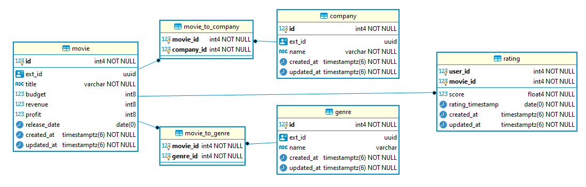

# Code Test Submission Answers

## Usage
This project requires sbt 1.x to run. This can either be [installed](https://www.scala-sbt.org/download.html) or using the provided `sbt` script in the base directory.

**Download the data**
> sbt fetchData

This will create a directory [temp/](temp/) in the base directory of this project. The CSV files will be unzipped in place for use in the program. You don't need to move them once downloaded.

**Running**
> sbt run

The output of the program will create a directory [temp/output](temp/output/) and appends the raw Scala Case Classes as strings. This is temporary behavior to avoid any further data manipulation until the data models are ready to be hydrated in a data store.

## Schema
I have provided a postgresql schema for the data model which can be found at [data-model.sql](data-model.sql)

## Program Layout

[Main.scala](../src/main/scala/com/bsamaripa/Main.scala) contains all of the functions responsible for IO within the program as well as the main application run function.

[MovieData.scala](../src/main/scala/com/bsamaripa/MovieData.scala) is where the case class versions of the data model live as well as companion objects with helper functions for transforming to those case classes.

## Data Transformation

For this project, I opted to go with Scala for its built-in Case Classes which add strong type safety while encoding to ensure high quality data is being transferred from the program to the data store. The amount of processing needed is minimal considering the input format is CSV and the output database schema is very similar to the original data fields. The layout of the program makes extending transformations 

## Data Storage
The initial implementation of this API would rely on a simply SQL backend, in this case I went with Postgresql but any flavor of SQL would work well. In designing the database schema, I went with join tables and foreign key constraints over storing the json directly into the specific fields. This choice makes querying the data significantly easier to think about when writing sql queries.
When choosing which fields to add, I went with the minimum amount possible to start knowing that more data columns can be added relatively easily. Additionally, I added several extra fields to the main model tables - ext_id, created_at, updated_at. 
The created_at and updated_at fields are created and updated during insert and update so there is no overhead required for the database user. These two fields are invaluable when triaging data errors in a production database.  
The ext_id field is an automatically generated uuid for use as an External identifier in the API. Having globally unique ids for resources throughout a system provides a simple way for your end user to fetch data from the API. It should be noted that this is not the same as the internal id as do not want to expose an internal id outside of the system.

## Data Serving

Implementing a simple RESTful API would be a quick exercise given the limited scope of the API. I have created an OpenAPI Spec with a few details to show the basics of the API according to the requirements. The data would be read-only through the API and the server that is queries would directly access a sql server to make the queries and then cache the results.
See [api-design.yml](api-design.yml)

Eventually a GraphQL layer could be added to help provide more complex queries to the API consumer. The initial implementation of a GraphQL API can be done by calling already exposed RESTful endpoints from the GraphQL service. GraphQL has relatively mature ecosystem in a short period and provides a nice way for front-end developers to make as few network requests as possible to propagate a page they're rendering.

## Scaling
 As the amount of data increases and the aggregations begin to scale up, it would be worth moving this to a cloud based database service such as AWS RDS. This would get us good performance as well as flexible scaling should the need arise. In addition, caching layers can be added to the higher or more resource intensive models to decrease load on the database for larger queries. This could be in memory caching or could be a key-value database such as Redis. 
 Long-term, much of the data will become relatively Cold and wouldn't need to stay inside of a relational database for constant usage. One option at this point would be to archive the data to a service like S3 where the data is accessible but cost to maintain is low.

 ## Improvements
 During my work on this assignment, there were some choices I made for the sake of time that I would normally want to address if making production ready code.

 * Completion - The most obvious improvement I would make would be to send this data model to a database and build an API to access it.
 * Testing - This program lacks unit and integration testing.
 * Data Cleansing - The parsing of the CSV data is fairly noisy and unpredictable. I would want to add more filtering and shaping of the data to ensure characters are being escaped properly and formatted as best before parsing. There is also a lot of duplicate data in the system that could be cleaned up but that would be a human administrative task. I.E. Several Production Company entries that have unique IDs but are the same company.
 * Pipelining - Much of the work needs to be done in serial but there are noticeable parts that could be pipelined to improve overall throughput and reduce the time to run as the incoming data set gets larger.
 * Configuration - Many values were hardcoded into the program that could be passed in through configuration and through environment variables. It didn't make sense to this extra step for a design challenge but is good practice for production applications. 
 * API Documentation - I am a big proponent of OpenAPI/Swagger docs being provided for APIs. A well documented API can be a big selling point when deciding between similar services. Stripe has one of the best sets of API documents around and that drove much of the early developer interest.